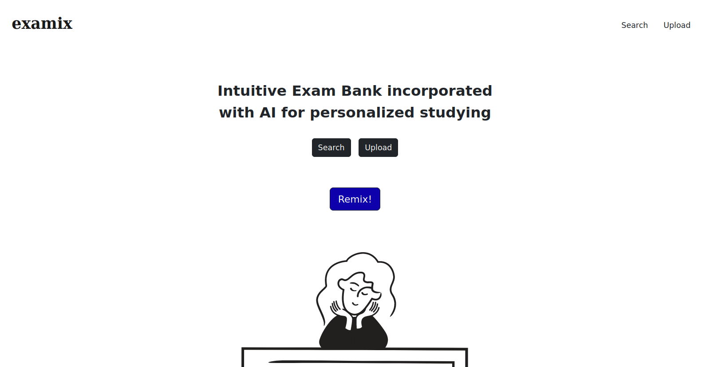

# examix
**nwHacks 2024 submission** &#124; Intuitive Exam Bank incorporated with AI for personalized studying.

## Environment setup
examix uses the Flask and React frameworks with a SQLite database backend and Google
Document AI for document parsing. Our backend scripts are written in Python. To
set up the approipte Python modules, use the provided `requirements.txt` file:

`$ pip install -r requirements.txt`

To host the document upload backend, you'll need a Google Cloud account setup
with a Document OCR processor set up. If you're unfamilar with the process,
Google has a good tutorial at https://codelabs.developers.google.com/codelabs/docai-ocr-python

You'll also need SQLite installed on your device. On Linux, installing the
`sqlite` package from your package manager is usually sufficient.

## Running the app
First, intialize the database with the following command:

`flask --app flaskr init-db`

Then, the local development server can be started with:

`$ flask --app flaskr run`

* The website will be hosted locally on port 5000
* You can add the `--debug` option to enable auto server reloading on code changes

### Adding sample data to the database
In a web browser, visit [localhost:5000/request](http://localhost:5000/request) to populate the database with
sample course and exam data. You will see a 'success' message if the database
was populated successfully.

## Deploying the app
Work in progress!

## Contributing
We use feature based branches - to begin work on a feature or bugfix, create a
branch for the your contributions on the feature.

